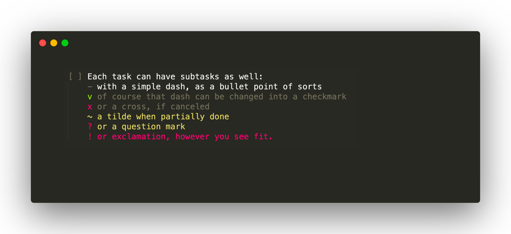
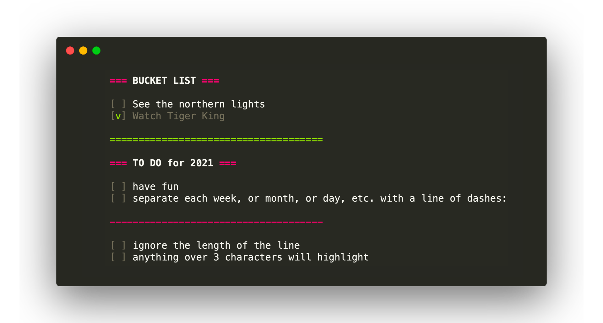
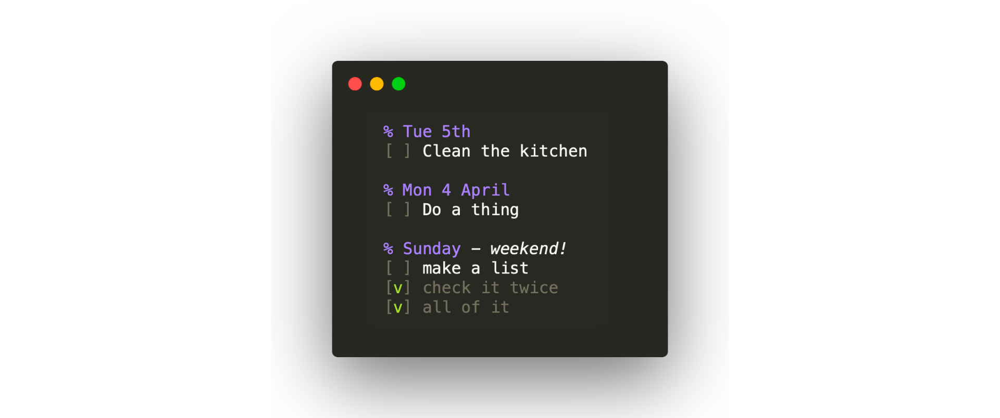

# A new, nameless, plaintext To-Do format

This is a newish format for tracking task lists in plain text format.
It revolves around checkboxes

```
[ ] 
```

that can be checked off

```
[v]
```

Using this format you can keep track of your daily tasks and keep a complete
log of everything you've done.

Here's a short example:

```
Wed 20 May
[ ] do this task today
[v] this task is done
[ ] this is an open task with sub-tasks
	- for example this one
	v this one is completed
	- this one is not
``` 

Keep reading for the specs below, or jump straight to a [complete example](./example.txt). 

# Sublime Text highlighter

This repo includes a syntax file for Sublime Text 3 which, when used with
the Monokai theme, nicely highlights items and greyes out completed task
in a way that makes it easy to see the state of your task list at a glance.
Installation instructions [below](#installation-instructions).


# Questions

#### Why plain text?

Competing spec [todo.txt][todotxt] explains it better than I can:

> Plain text is software and operating system agnostic. It's searchable, portable, lightweight, and easily manipulated. It's unstructured. It works when someone else's web server is down or your Outlook .PST file is corrupt. There's no exporting and importing, no databases or tags or flags or stars or prioritizing or _insert company name here_-induced rules on what you can and can't do with it.

To add onto this: it is compatible with any cloud solution, like Dropbox or Git.

#### When _not_ to use this format

This format is new and not supported by any clients other than plain text editors.
If you care about support by other apps with a nice UI, or CLI clients, don't use this!

#### Why not [todo.txt][todotxt]?

Todo.txt is nice, but it did not fit _my_ needs. So I made something new.

I found it not easily readable at a glance. Each task is confined to one line,
there are no subtasks; and all tasks, checkmarks and timestamps are all over the place.
I preferred something that looked like a bulleted list with checkboxes more
than anything else, and I found prioritizing items by starting lines with
`(A)` or `(B)` unclear and unpractical.

This new to-do approach targets the average, quick, daily to-do list rather than
an issue tracker for projects. You list what you do today, without categorising
using tags, project names, due dates or priorities.

If you want to add priority to a task, simply move it to the top.

#### Why not Markdown?

Markdown's checkboxes only allow for two states: done, or not done, and has no room for
'sort ofs'. It also requires two more characters to add a checkbox: `- [*]`. Yuk!
Do I have to justify this repo? No, I just like my format okay, leave Britney alone!


# Complete specs

#### Task states

Tasks and subtasks alike can exist in several states:

- open  (`[ ]`)
- completed (`[v]`)
- canceled (`[x]`)
- may be canceled (`[?]`)
- maybe completed (`[~]`)

The first 3 speak for themselves, the other two indicate uncertainties. For example,
if you partially completed a task and are not sure yet if it is 'good enough',
use the `~` tilde to change the color of the task to yellow: it's not greyed
out yet, but it is highlighted so you can easily find it and go back to it.


#### Subtasks

The same goes for subtasks. With the exception that they are shaped more like a bulleted
list (no `[` `]` brackets, and a `-` dash for open items). The state indicators
have the same effect:



When a main task is closed or highlighted, this effects the subtasks too.


#### Grouping lists

To make lists of lists, you can add titles and separators:




#### Dates

Personally, I don't see this as due dates but rather as the dates on which you plan
to do something. Does 'clean the kitchen' have a due date? Not really, but if you have
time this Tuesday, that's when you schedule it. Here's an example workflow:




#### Time

Again not a due time, but rather a time indication. "Package will be delivered between 15:00 and 18:00" will
look like this:


# Installation instructions

The syntax highlighter is not in the Sublime package thing yet.

On Mac, you can copy the `todo.sublime-syntax` file to `/Library/Application Support/Sublime Text 3/Packages/User/`.

On Windows, to `C:\Users\{username}\AppData\Roaming\Sublime Text 3\Packages\User\`.


# License

```
Copyright © 2020 Mathijs Lagerberg
This work is free. You can redistribute it and/or modify it under the
terms of the Do What The Fuck You Want To Public License, Version 2,
as published by Sam Hocevar. See the COPYING file for more details.
```


[todotxt]: https://github.com/todotxt/todo.txt
